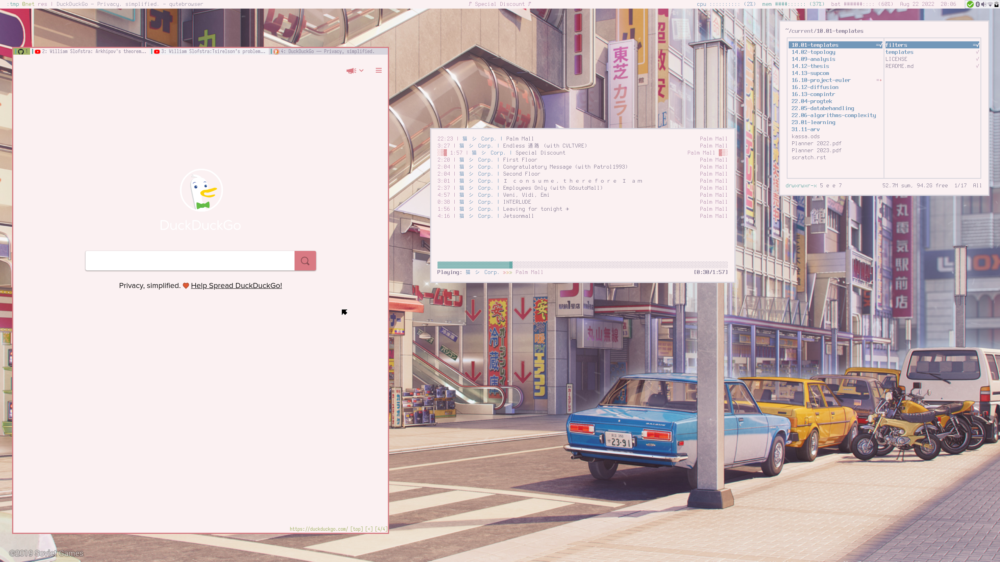
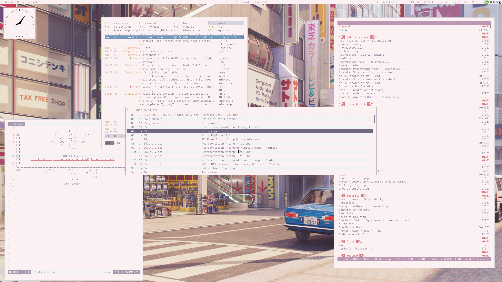
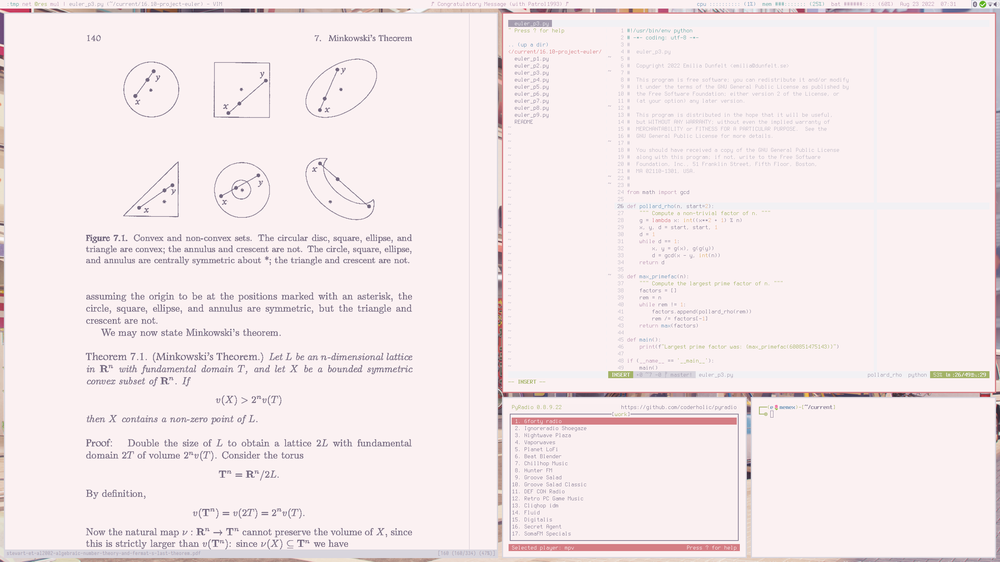

```
                                                              
 ______         ,-----.  ,---------.   .-'''-.         
|    _ `''.   .'  .-,  '.\          \ / _     \        
| _ | ) _  \ / ,-.|  \ _ \`--.  ,---'(`' )/`--'        
|( ''_'  ) |;  \  '_ /  | :  |   \  (_ o _).           
| . (_) `. ||  _`,/ \ _/  |  :_ _:   (_,_). '.         
|(_    ._) ': (  '\_/ \   ;  (_I_)  .---.  \  :        
|  (_.\.' /  \ `"/  \  ) /  (_(=)_) \    `-'  |        
|       .'    '. \_/``".'    (_I_)   \       /         
'-----'`        '-----'      '---'    `-...-'          
                                                       
``` 

# Emilia's dotfiles
This is my collection of dotfiles, for easy management I use [GNU Stow](https://www.gnu.org/software/stow/).

Beware! These configurations are *my preferences* and might not suit you - if you do decide to use
these dotfiles, don't hesitate to modify things to your liking.


## screenshots
WS1 - with qutebrowser, ncmpcpp, ranger


WS2 - with vim(wiki), weechat, newsboat, rofi


WS3 - (almost) actual work this time! with zathura, vim, pyradio


## notes on the setup
### what I use
* Colorscheme: [Cupcake](https://github.com/base16-project/base16-schemes)
* Font: [Terminus](https://sourceforge.net/projects/terminus-font/)
* WM: [Xmonad](https://xmonad.org/)
* Bar: [Xmobar](https://xmobar.org/)
* Menu: [rofi](https://github.com/davatorium/rofi), [XMonad TreeSelect](https://hackage.haskell.org/package/xmonad-contrib-0.16/docs/XMonad-Actions-TreeSelect.html), and [XMonad Prompts](https://hackage.haskell.org/package/xmonad-contrib-0.16/docs/XMonad-Prompt.html)
* Notifications: [dunst](https://github.com/dunst-project/dunst)
* Editor: [Vim](https://www.vim.org/)
* File manager: [Ranger](https://github.com/ranger/ranger)
* Browser: Firefox and [Qutebrowser](https://qutebrowser.org/)
* Terminal: [Kitty](https://github.com/kovidgoyal/kitty/tree/604458810e5248fd2869131d4b440f38541a1d95)
* Shell: [Zsh](https://zsh.sourceforge.io/)
* OS: Ubuntu

### installation
Make sure to **backup your own settings** before applying!

```
git clone https://github.com/edunfelt/dots
cd dots
stow
``` 

If you only want the vim settings:

```
stow vim
```

### to-do
This is forever an ongoing project, and things are constantly changing. Here are my next steps:

- [ ] document things
- [ ] clean up comments in files
- [ ] branch(es) for other machine(s)
- [ ] document papis workflow

