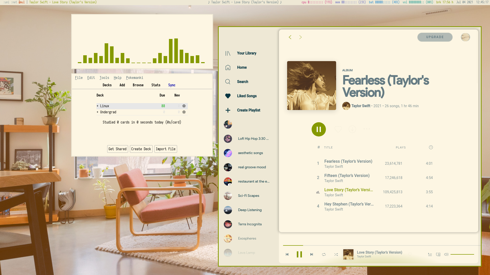
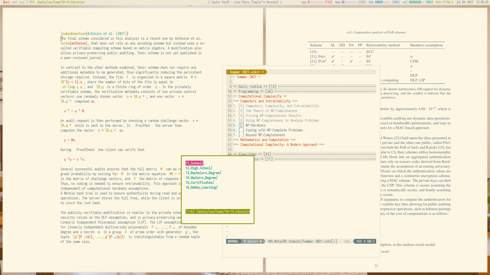
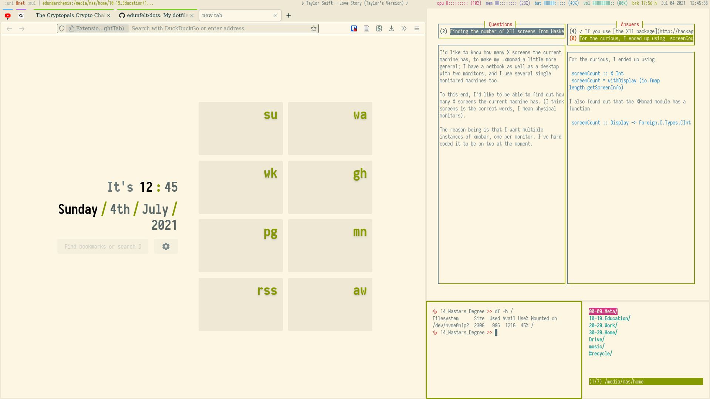
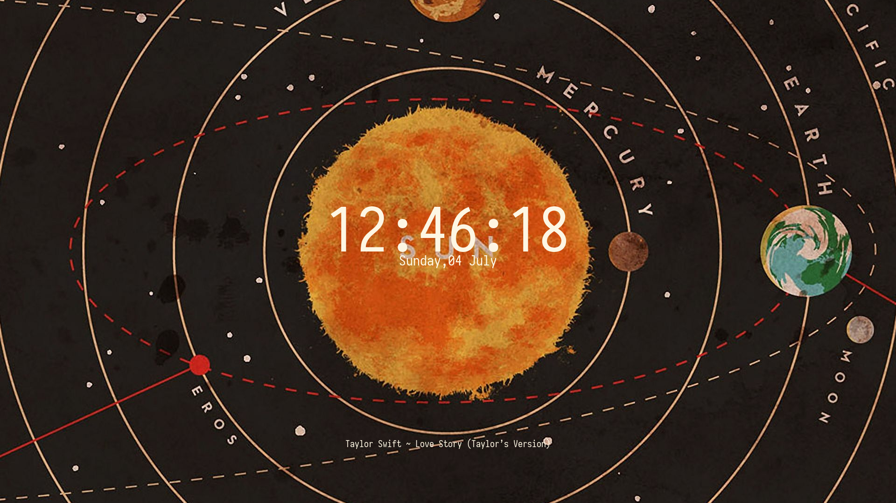

# Emilia's dots
My dotfile collection!

## Screenshots
WS1 - with Spotify, cava, and anki (floating)

WS2 - with vim, zathura, and scratchpads fff and vimwiki (with gaps)

WS3 - with firefox, so, and fff (no gaps)

Lockscreen

## Current setup
### What I use
* Colorscheme: [Solarized Light](https://ethanschoonover.com/solarized/)
* Font: [Iosevka](https://github.com/be5invis/Iosevka/tree/e213a5918c5a0cb1012aef912be7ad933978075a)
* WM: [Xmonad](https://xmonad.org/)
* Bar: [Xmobar](https://xmobar.org/)
* Menu: [dmenu](https://tools.suckless.org/dmenu/), [XMonad TreeSelect](https://hackage.haskell.org/package/xmonad-contrib-0.16/docs/XMonad-Actions-TreeSelect.html), and [XMonad Prompts](https://hackage.haskell.org/package/xmonad-contrib-0.16/docs/XMonad-Prompt.html)
* Notifications: [dunst](https://github.com/dunst-project/dunst)
* Session lock: [i3lock-color](https://github.com/Raymo111/i3lock-color)
* Editor: [Vim](https://www.vim.org/)
* File manager:[fff](https://github.com/dylanaraps/fff)
* Browser: Firefox with [Stylus](https://github.com/openstyles/stylus/tree/83a6808c67958ab044cfde622e6a8adff55db61b) and [NightTab](https://github.com/zombieFox/nightTab/tree/e3dd87a9c95341b253c4c1f3edf233a894570f57)
* Terminal: [Kitty](https://github.com/kovidgoyal/kitty/tree/604458810e5248fd2869131d4b440f38541a1d95)
* Shell: [Bash](https://www.gnu.org/software/bash/)
* OS: [Arch Linux](https://archlinux.org/)

