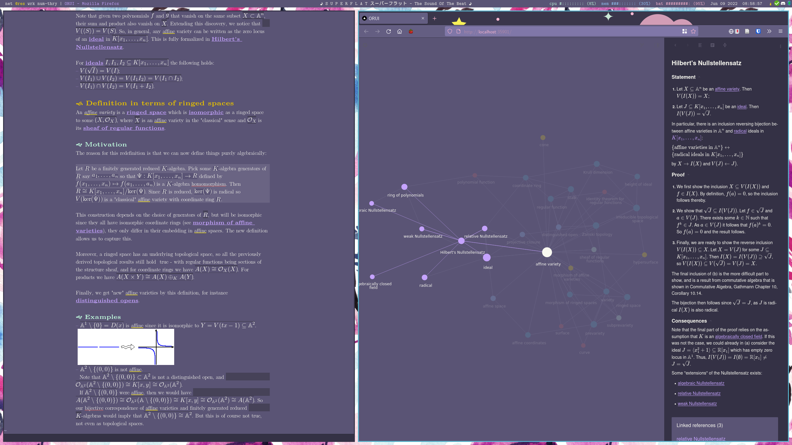
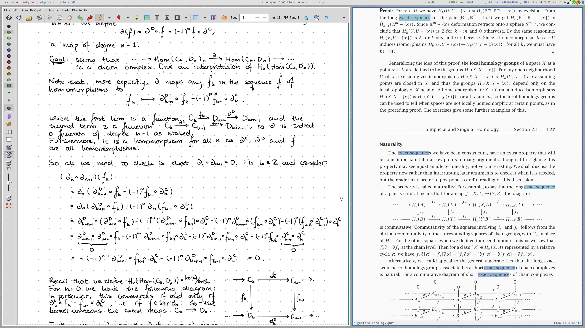
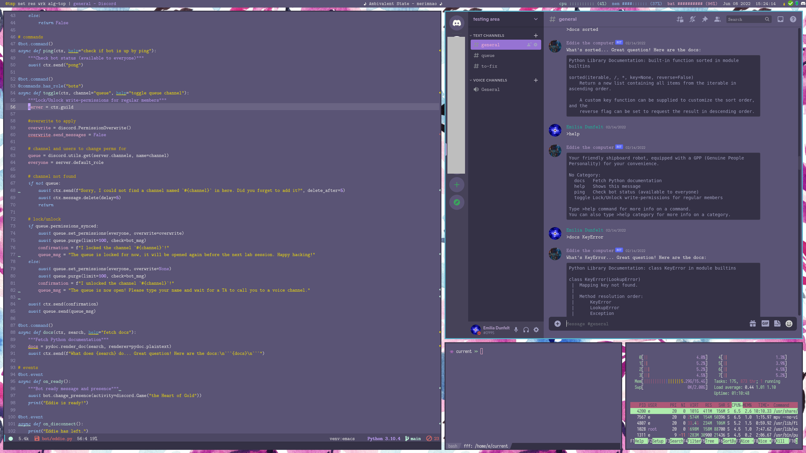

# Emilia's dotfiles
This is my collection of dotfiles, for easy setup I use [GNU Stow](https://www.gnu.org/software/stow/).

## screenshots
WS1 - with emacs and firefox

WS2 - with zathura, pyradio, and thunar

WS3 - with emacs, kitty, and discord (themed using beautiful discord)

## notes on the setup
### what I use
* Colorscheme: [Fairyfloss](https://sailorhg.github.io/fairyfloss/)
* Font: [Latin Modern](https://www.gust.org.pl/projects/e-foundry/latin-modern)
* WM: [Xmonad](https://xmonad.org/)
* Bar: [Xmobar](https://xmobar.org/)
* Menu: [dmenu](https://tools.suckless.org/dmenu/), [explore-with-dmenu](https://github.com/langenhagen/explore-with-dmenu/tree/de36693901ee9b2fb0ac58330f2948f42dc48e2f), [XMonad TreeSelect](https://hackage.haskell.org/package/xmonad-contrib-0.16/docs/XMonad-Actions-TreeSelect.html), and [XMonad Prompts](https://hackage.haskell.org/package/xmonad-contrib-0.16/docs/XMonad-Prompt.html)
* Notifications: [dunst](https://github.com/dunst-project/dunst)
* Editor: [Doom Emacs](https://github.com/doomemacs/doomemacs), but also [Vim](https://www.vim.org/)
* File manager: [fff](https://github.com/dylanaraps/fff)
* Browser: Firefox
* Terminal: [Kitty](https://github.com/kovidgoyal/kitty/tree/604458810e5248fd2869131d4b440f38541a1d95)
* Shell: [Bash](https://www.gnu.org/software/bash/)
* OS: Ubuntu

