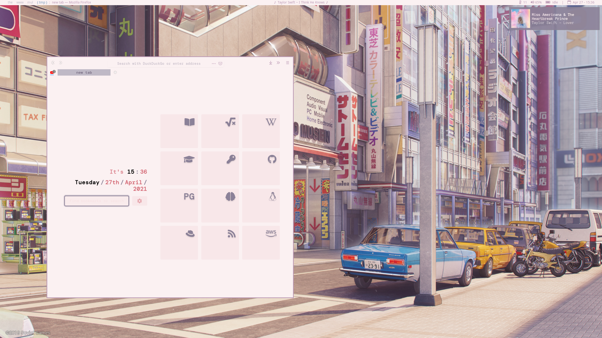
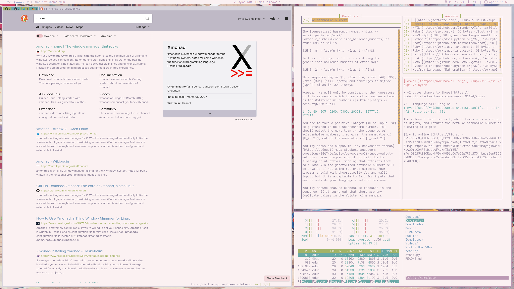
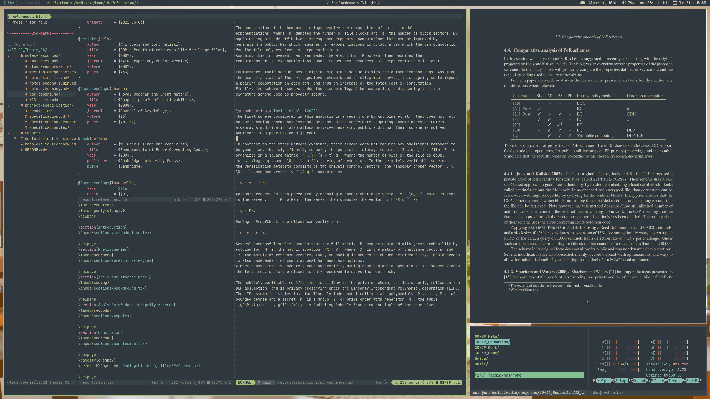

# Emilia's dots
My new dotfile collection!

## Screenshots
Ws1 - { tmp } with Firefox and dunst

Ws2 - { www } with qutebrowser, so, htop, and fff

Ws3 - { mul } with spotify, doom emacs, dunst, and cava

Ws4 - { the } with vim, zathura, zotero (tabbed), and GridSelect menu

Lockscreen

## Current setup
### What I use
* Colorscheme: [Base16](https://github.com/chriskempson/base16) Cupcake and [flavours](https://github.com/misterio77/flavours)
* Font: [Anonymice Nerd Font](https://www.nerdfonts.com/#home)
* WM: [Xmonad](https://xmonad.org/)
* Bar: [Xmobar](https://xmobar.org/)
* Menu: [dmenu](https://tools.suckless.org/dmenu/), [XMonad TreeSelect](https://hackage.haskell.org/package/xmonad-contrib-0.16/docs/XMonad-Actions-TreeSelect.html), and [XMonad Prompts](https://hackage.haskell.org/package/xmonad-contrib-0.16/docs/XMonad-Prompt.html)
* Notifications: [dunst](https://github.com/dunst-project/dunst)
* Session lock: [i3lock-color](https://github.com/Raymo111/i3lock-color)
* Editor: [Vim](https://www.vim.org/)
* File manager:[fff](https://github.com/dylanaraps/fff)
* Browser: [qutebrowser](https://qutebrowser.org/)
* Shell: [Bash](https://www.gnu.org/software/bash/)
* OS: [Arch Linux](https://archlinux.org/)
